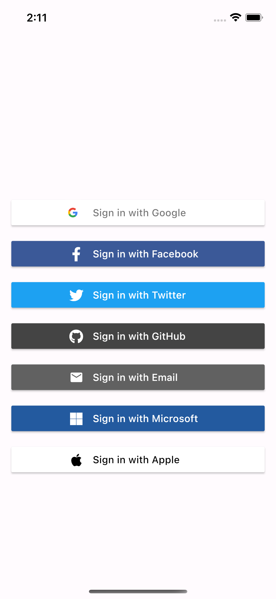

# Flutter Social Login

## Description

This is a simple flutter app that shows how to implement social login with firebase.

- Google
- Facebook
- Twitter
- Github
- Microsoft
- Apple
- Email

## packages used

- [google_sign_in](https://pub.dev/packages/google_sign_in)
- [firebase_auth](https://pub.dev/packages/firebase_auth)
- [firebase_core](https://pub.dev/packages/firebase_core)

## Getting Started

First, you need to create a firebase project and add the android and ios apps.

- [Firebase](https://firebase.google.com/)

Then, you need to configure the social login providers.

- [Google](https://firebase.google.com/docs/auth/android/google-signin)
- [Facebook](https://firebase.google.com/docs/auth/android/facebook-login)
- [Twitter](https://firebase.google.com/docs/auth/android/twitter-login)
- [Github](https://firebase.google.com/docs/auth/android/github-auth)
- [Microsoft](https://firebase.google.com/docs/auth/android/microsoft-oauth)
- [Apple](https://firebase.google.com/docs/auth/ios/apple)

## How to run

```bash
git clone https://github.com/sinnoorc/flutter-social-login.git
```

```bash
cd flutter-social-login
```

```bash
flutter pub get
```

```bash
flutter run
```

## Screenshots

| [] | []

## Follow me on

- [Twitter](https://twitter.com/sinnoor___)
- [Instagram](https://www.instagram.com/sinnoor___/)
- [LinkedIn](https://www.linkedin.com/in/sinnoor-c/)
